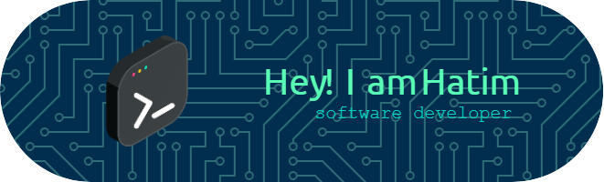

<!------>

Passionate programmer, student at 1337, with a focus on backend development. Enthusiastic about learning new technologies and solving complex problems.

Skills: NestJS / Docker / JS / TS / C++ / C

- 🌱 I’m currently learning React, CyberSecurity 

## Contact me
      

